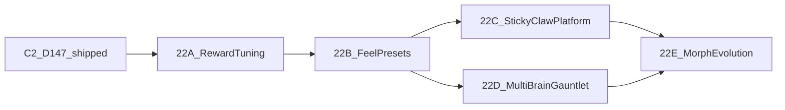

# Ideas Development Plan — Phase 22

**Status:** 22A shipped (D148); next plan 22B  
**Planned:** 2026-07-31  
**Scope:** Five approved pillars from `Ideas.txt`  
**Authority:** D148+ in `DECISIONS.md`; shipped truth in `COMPLETED.md`

## Approved pillars

1. Smoother / weightier sim feel (presets + Studio↔arena alignment)
2. Physically evolving creatures (morphological evolution)
3. Exposed live reward / penalty tuning (built-in coeffs)
4. New creature parts (sticky, claw, platform, …)
5. Adaptable creatures / multi-brain Gauntlet

## Sequencing

C2 contact sensor shipped as D147 (`4.23.0`). Reward tuning and feel are
split so a reward rewrite never lands with solver feel changes.

| Sub-phase | Scope | Status |
|---|---|---|
| **22A** | Live built-in reward tuning (SPEED + JUMP_SPEED) | **Shipped (D148)** |
| **22B** | Feel presets + Studio↔arena alignment | **Next — plan fully before code** |
| **22C** | Sticky → claw → platform (one vertical slice each) | After 22B |
| **22D** | Multi-brain bank + Gauntlet | Can parallel 22C |
| **22E** | Morphological evolution | Later |

---

## Phase 22A — Live built-in reward tuning

### Intended outcome

Users can live-edit built-in fitness coefficients for **SPEED** and
**JUMP_SPEED**, see the same terms in the rewards overlay, reset to defaults,
and freeze a recipe so shelf / Best Ever scores are not compared unfairly
across recipes.

### Non-negotiable contracts

- Default coeffs remain exactly the pre-22A shipped numbers (no silent retune).
- `calculateFitness` and `calculateRewardBreakdown` share one coeff table.
- Custom goals stay on `CustomGoalConfig`; systems are not merged.
- No physics damping, gravity, D142, contact, or part-type changes in 22A.
- Non-default recipes are visible in UI and persisted on freeze / Best Ever.

### Design

1. **`src/builtInRewardCoeffs.ts`** — typed recipe for SPEED / JUMP_SPEED;
   fingerprint helpers; default recipe matches prior literals.
2. **`SimulationConfig.rewardRecipe`** — optional; omit means defaults.
3. **UI** — sliders on `RewardsBreakdownPanel` for pilot goals; reset + badge.
4. **Fairness** — `FinishedModel.rewardRecipe` + fingerprint; Best Ever keyed by
   `goal` (default) or `goal::fingerprint` (custom).

### Exit gate

- Default recipe: existing `smoke-speed` / jump smokes still pass.
- Non-default peak coeff changes fitness and breakdown identically.
- Fingerprint differs from default; freeze stores recipe; Best Ever under
  default is unchanged by custom-recipe runs.

**Shipped evidence (2026-07-31):** `scripts/smoke-builtin-reward-recipe.ts` PASS;
`scripts/smoke-speed.ts` PASS; D148 recorded.

### Later phases (sketch — plan fully before each)

**22B Feel:** Centralize `VELOCITY_DAMPING`; align Studio gravity/relaxation;
optional light/heavy presets; gate with physics/locomotion/flight smokes.

**22C Parts:** Sticky feet → grab claw → platform (piston+solid); exploit
smokes; no reward rewrite mix.

**22D Gauntlet:** Populate `CreaturePackage.controllers[]`; zone/goal selector;
composite course score.

**22E Morph evo:** Body genome + viability + I/O remap; start with Run only.
